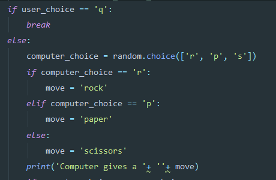
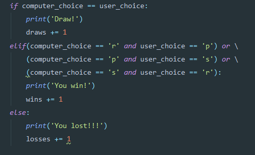
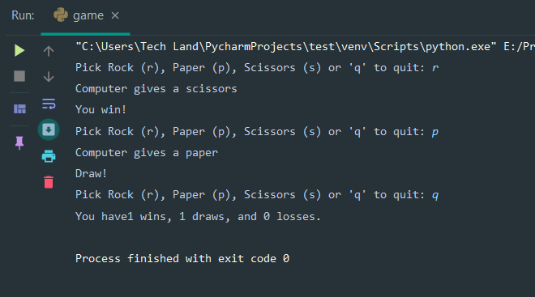

# Rock Paper Scissor game in Python #

prompt takes an input from user through `prompt` and stores it in `user_choice` variable.

### You (user) can pick between four things  ###

    * Rock if you press `r`
    * Paper if you press `p`
    * Scissors if you press `s`
    * Quit the game if you press `r`

##### This part of the code compels the user to take an input between rock,paper or scissors #####

`    while user_choice not in ['r', 'p', 's', 'q']:
        user_choice =input(prompt)`

----

##### This part of the code defines the computer's move using `random.choice()` #####

----

##### This part of the code shows the result and stores the output until you press `'q'` #####

----

#### Have fun playing! ####

Give a star if this helps.

