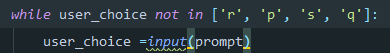

# Rock Paper Scissor game in Python #
----
prompt takes an input from user through `prompt` and stores it in `user_choice` variable.

##### This part of the code compels the user to take an input between rock,paper or scissors #####

